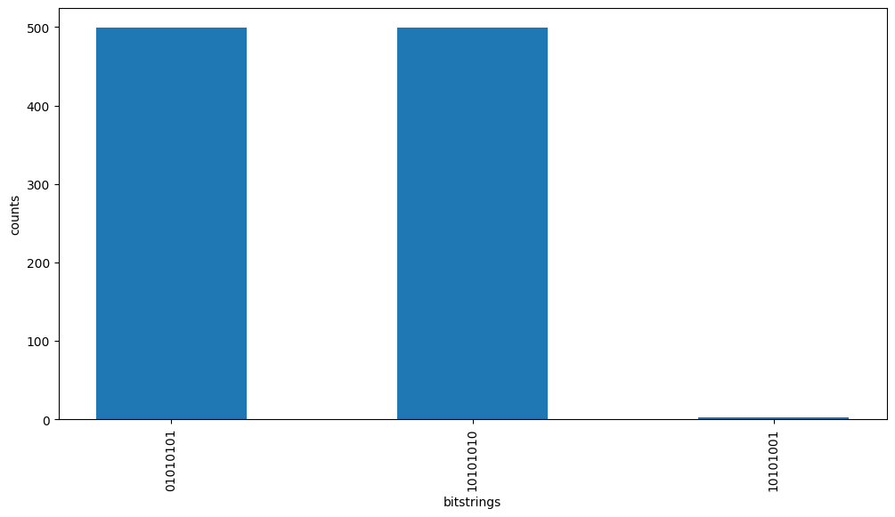
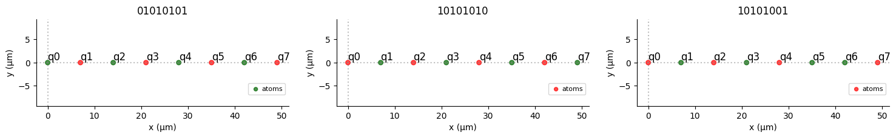

# Gadget Prototypes

In this directory we have attempted to study quantum gadets used in our CSP quantum algorithm using Pulser's library. The two gadgets we have investigated are the copy and crossing gadgets.

## Crossing Gadgets

The notebook `crossing_gadget.ipynb` contains a simulation of a simple crossing gadget. We demonstrate the high fidelity by which the device operates.

The red atoms are in the Rydberg state, and the green atoms are in the ground state.

The four most likely outcomes of the simulation by far are the four expected patterns predicted in the document for a crossing gadget.

## Copy Gadgets

We have demonstrated a simple simulation of the copy gadget under `copy_gadget.ipynb`. We demonstrate the low fidelity of this gadget under `copy-gadget_defect_demonstration.ipynb`. Defect is the terminology used for addressing instances in which the copy gadget does **not** accomplish its task. The expected behavior of the gadget is that every other state becomes excited, but due to non-local Rydberg-Rydberg interactions a gap occurs and two adjacent ground states appear.

The image above contains the three most likely outcomes of the copy gadget implemented as it is described in the original paper by Harvard which introduced it (See [here](https://arxiv.org/pdf/2209.03965.pdf), Nguyen et al. 2023)

Under `copy_gadget_defect_free.ipynb` we demonstrate how to compensate for this low fidelity by introducing site-selective detunings. We effectively introduce a detuning-gradient along the direction of the copy gadget to make it such that the excited states prefer to be as close as possible to the target qubit (on the left). The exception is the detuning of the second atom, which is higher than the detuning of all atoms. This is so that the possibility of the first atom being in the ground state or excited state is $50%$, so that the copy gadget is symmetric.

